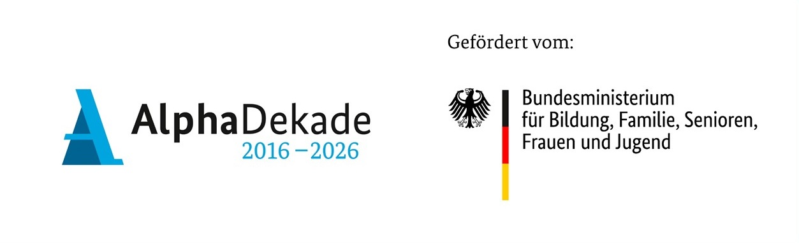

# ABCforJobs
In diesem Repository finden Sie in Kürze alle Ergebnisse (Serious Games und VR Applikationen) aus dem Projekt #ABCforJobs. www.abcforjobs.de 
<i>(This repository contains the results from the pilot project #ABCforJobs)</i>

# Syllable Soup (Virtual Reality)
 <ul>
  <li><b>Platform:</b> Windows (Unity, Steam VR)</li>
  <li><b>Hardware:</b> HTC Vive Pro 2, HTC Vive Tracker 3.0</li>
  <li><b>Beschreibung:</b></li>
  <li><b>Download:</b></li>
  <li><b>Repository:</b></li>
  <li><b>Wissenschaftliche Evaluation/Publikation:</b></li>
</ul> 

# VRoom Service (Virtual Reality)
<ul>
  <li><b>Platform:</b> Android (Unity Build)</li>
  <li><b>Hardware:</b> Meta Quest 3</li>
  <li><b>Beschreibung:</b></li>
  <li><b>Download:</b></li>
  <li><b>Repository:</b></li>
  <li><b>Wissenschaftliche Evaluation/Publikation:</b> https://doi.org/10.25162/sprib-2024-0010</li>
</ul>

# Sky Dash
<ul>
  <li><b>Platform:</b> Android, iOS, Browser (WebGL)</li>
  <li><b>Hardware:</b> Tablet (z.B. Apple iPad), PC</li>
  <li><b>Beschreibung:</b></li>
  <li><b>Download:</b></li>
  <li><b>Im Browser spielen:</b> https://abcforjobs.itch.io/sky-dash (Passwort: abcforjobs)</li>
  <li><b>Repository:</b></li>
  <li><b>Wissenschaftliche Evaluation/Publikation:</b> https://dl.acm.org/doi/10.1007/978-3-031-74138-8_16</li>
</ul>

# Laut-Manager
<ul>
  <li><b>Platform:</b> Windows, Android, iOS, Browser (WebGL)</li>
  <li><b>Hardware:</b> Tablet (z.B. Apple iPad), PC</li>
  <li><b>Beschreibung:</b></li>
  <li><b>Download:</b></li>
  <li><b>Im Browser spielen:</b> https://abcforjobs.itch.io/laut-manager (Passwort: abcforjobs)</li>
  <li><b>Repository:</b></li>
  <li><b>Wissenschaftliche Evaluation/Publikation:</b></li>
</ul>

<b>Troubleshooting:</b> Im Fall von Fragen oder Problemen, wenden Sie sich bitte an benjamin[dot]schnitzer[at]korion[dot]de

<i><b>Förderhinweis</b> 
Die Produkte wurde im Rahmen der Nationalen Dekade für Alphabetisierung und Grundbildung 2016-2026 mit Mitteln des Bundesministeriums für Bildung, Familie, Senioren, Frauen und Jugend unter dem Förderkennzeichen W-1505A-AOG gefördert.</i>
